# Развертывание Telegram-бота "AZU Кафе"


## 1. Подготовка сервера

### 1.1 Системные требования

Системные требования соответствую системным требованиям к Ubuntu Server 22.04

- **CPU** - 1Ghz и выше (2 ядра и более)
- **Память** - 1Gb и выше (лучше не менее 2Gb)
- **Дисковое пространство** - 20Gb минимум (лучше 25-30Gb). Размер определяется интенсивностью использования бота

### 1.2 Настройка русской локали

#### Добавление русского языка в локаль

Устанавливаем/обновляем пакет `locales`:

```shell 
sudo apt install locales
```

Конфигурируем локаль:

```shell
sudo dpkg-reconfigure locales
```

В открывшемся диалоговом окне прокручиваем список до строчки `ru_RU.UTF-8 UTF-8` и выбираем ее.

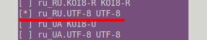

Далее, выбираем ее в качестве локали по умолчанию.

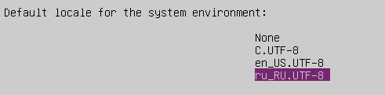

#### Настройка часового пояса (timezone)

Проверяем доступные в системе `timezone` и выбираем ближайшую к местоположению.

```shell
timedatectl list-timezones
```

> В нашем случае выбираем часовой пояс Москвы - `Europe/Moscow`

Устанавливаем часовой пояс

```shell 
sudo timedatectl set-timezone Europe/Moscow
```

Проверяем, что все установилось

```shell
date
```

> Вывод будет примерно такой `Mon Feb 5 12:52:49 PM MSK 2024`

#### Настройка отображения даты/времени в соответствии с локалью

Выполняем команду

```shell
sudo update-locale LANG=en_US.UTF-8 LC_TIME="ru_RU.UTF-8"
```

После этого необходимо завершить сеанс пользователя и залогиниться снова, чтобы изменение формата вступило в силу.

### 1.3 Установка и настройка Docker

#### Установка Docker

Для запуска бота используется система контейниризации [Docker](https://docs.docker.com/engine/install/).

Для начала удаляем предыдущие установки docker, если они были

```shell
for pkg in docker.io docker-doc docker-compose docker-compose-v2 podman-docker containerd runc; do sudo apt-get remove $pkg; done
```

Устанавливаем Docker engine

```shell
curl -fsSL https://get.docker.com | sudo sh -
```

#### Настройка Docker

Останавливаем службу `docker`

```shell
sudo systemctl stop docker
sudo systemctl stop docker.socket
```

В каталоге `/etc/docker/` создаем файл `daemon.json`:

```json
{
  "log-driver": "json-file",
  "log-opts": {
    "max-size": "10m",
    "max-file": "10"
  }
}
```

Запускаем службу `docker`

```shell
sudo systemctl start docker
```

## 2. Подготовка переменных окружения на GitHub

Для автоматического развертывания бота в репозитории на [GitHub](https://github.com/) необходимо задать следующие секретные переменые (`Settings` - `Secrets and variables` - `Actions`):

- Настройки для работы бота:
  - `BOT_TOKEN` - токен для подключения к боту. Получается через [BotFather](https://t.me/BotFather)
  - `BOT_ADDRESS` - адрес бота (в формате https://t.me/<имя бота>)
  - `PAYMENT_TIMEOUT` - время ожидания оплаты, в минутах
- Настройки для работы панели администратора:
  - `ALOWED_HOSTS` - список хостов, на которых может запускаться проект. В обазятельном порядке указываются `django` и IP или доменное имя хоста, на котором развернут сервер. Хосты указываются через запятую, без http  и портов
  - `CSRF_TRUSTED_ORIGINS` - список доверенных хостов, с которых могут приходить запросф. В обазятельном порядке указываются `django` и IP или доменное имя хоста, на котором развернут сервер. Хосты указываются через запятую, с указанием протокола (http://, https://)  и порта. 
  - `SECRET_KEY` - буквенно-цифровая последовательность для шифрования (буквы - английские)
  - `ENGINE` - механизм, который используется для поключения к БД. В данном проекте должно быть равно `django.db.backends.postgresql`
  - `DEBUG` - если указано `True`, то при ошибках выводится отладочная информация, если `False` - выводится просто ошибка сервера
- Настройки для подключения к БД:
  - `POSTGRES_DB` - имя БД
  - `POSTGRES_HOST` - хост, на котором располагается БД. В данном проекте - `postgres`
  - `POSTGRES_PORT` - порт подключения к БД. В данном проекте - `5432`
  - `POSTGRES_USER` - имя пользователя для подключения к БД
  - `POSTGRES_PASSWORD` - пароль для подключения к БД
- Настройки для работы с [Робокассой](https://robokassa.com):
  - `MERCHANT_LOGIN` - идентификатор магазина
  - `MERCHANT_PASSWORD1` - пароль #1 из технических настроек магазина
  - `MERCHANT_PASSWORD2` - пароль #2 из технических настроек магазина
  - `TEST_MODE` - `True`, если оплата проводится в тестовом режиме, `False`- в противном случае.
- Настройки для подключения к [DockerHub](https://hub.docker.com/):
  - `DOCKER_USERNAME` - имя пользователя для подключения к [DockerHub](https://hub.docker.com/)
  - `DOCKER_PASSWORD` - пароль для подключения к [DockerHub](https://hub.docker.com/)
- Настройки для подключения к серверу, на котором развертывается бот, по SSH:
  - `SSH_HOST` - IP адрес или доменное имя сервера
  - `SSH_KEY` - SSH ключ (закрытый) для подключения к серверу. Открытый ключ должен быть размещен на  сервере
  - `SSH_PHRASE` - пароль для SSH ключа
  - `SSH_USER` - имя пользователя для подключения к серверу

## 3. Деплой проекта на сервер

Деплой проекта на сервер осуществляется автоматически при заливке кода в ветку `master` репозитория. Отслеживать процесс деплоя на сервер можно на вкладке `Actions`.

По умолчанию деплой осуществляется папку `/home/<SSH_USER>/azubot/infra/`. Папка имеет следующую структуру

```
.
├── config
│   ├── .general				Конфигурационный файл бота
│   ├── index.html				Файл заглавной страницы
│   └── nginx.conf				Конфигурационный файл web сервера NGINX
└── docker-compose_prod.yml		Конфигурационный файл для развертывания докер контейнеров
```


## 4. Первоначальная настройка

После первого деплоя проекта на сервер необходимо выполнить ряд первоначальных настроек

### 4.1 Создание суперпользователя

Что бы производить последующие настройки данных бота необходимо создать супер-пользователя. Для этого:

- переходим в папку `/home/<SSH_USER>/azubot/infra/`

  ```shell
  cd /home/<SSH_USER>/azubot/infra/
  ```

- выполняем команду

  ```shell
  sudo docker compose --file ./docker-compose_prod.yml exec -ti django bash

- После появления приглашения выполняем команду

  ```shell
  python manage.py createsuperuser
  ```

  и отвечаем на вопросы.

- Если требуется дополнительно загрузить тестовые данные, выполняем команду

  ```shell
  python manage.py lodadata base_data.json
  ```

- Выходим из оболочки, выполнив команду `exit` или нажав `Ctrl+d`

### 4.2 Ввод первоначальных данных о кафе

Если на предыдущем шаге были загружены тестовые даные, то днный шаг можно пропустить

- В браузере открываем страницу по адресу http://<IP адрес сервера> (или http://<доменное имя>). Отобразиться                                                  следующаястраница

  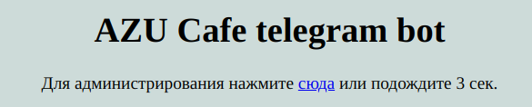

  которая через 3 сек переключится на страницу

  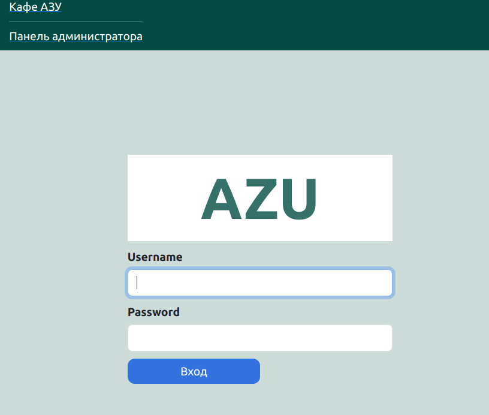

- Вводим имя пользователя (`Username`) и пароль  (`Password`), которые создали в разделе 4.1

- На появившейся странице нажимаем на кнопку `Настройка` 

  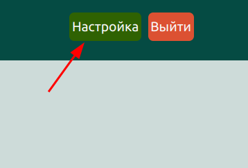

- Откроется страница настроек

  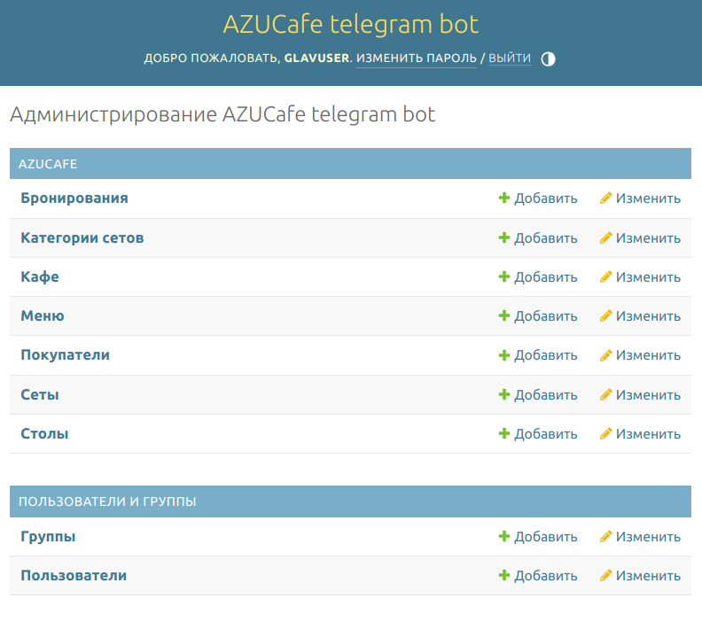

- На странице 2 группы:

  - `AZUCAFE` - настройка и просмотр всего, что связано с непосредственно с бронированием
  - `ПОЛЬЗОВАТЕЛИ И ГРУППЫ` - настройка доступа к администраторской части

#### 4.2.1 Добавление администраторов кафе

- Щелкнуть по ссылке `Пользователи` группы `ПОЛЬЗОВАТЕЛИ И ГРУППЫ`. Откроется страница для добавления администраторов кафе. Для добавления администратора кафе нажать на кнопку `Добавить пользователь`

  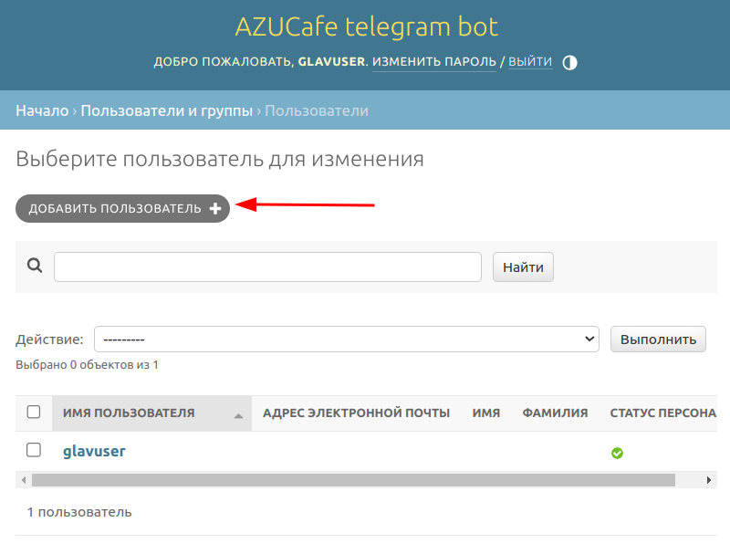

- Откроется страница для ввода имени пользователя (его логин в системе) и его пароля. После заполнения полей нажимаем кнопку `СОХРАНИТЬ`

  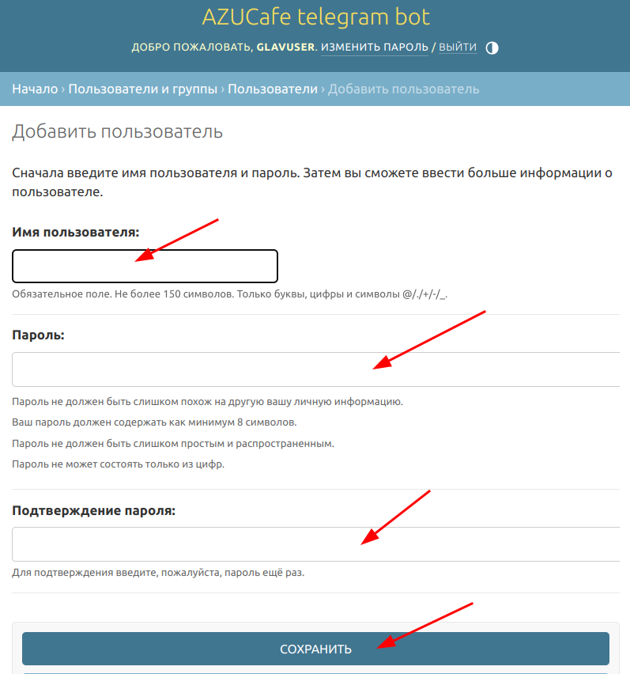

- Далее можно заполнить персональную информацию об администраторе, указать, что пользователь является суперпользователем (**ВАЖНО**. Не надо предоставлять права суперпользователя всем администраторам. Пользователь с правами суперпользователя имеет доступ ко **ВСЕМ** настройкам).

- По завершении ввода информации нажимаем кнопку `СОХРАНИТЬ`

- Повторяем действия для добавления всех необходимых администраторов кафе.

#### 4.2 Добавление кафе

- Возвращаемся на начальную страницу настроек

  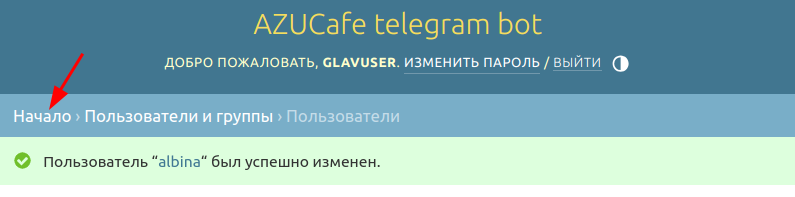

- Выбираем пункт`Кафе` группы `AZUCAFE`

  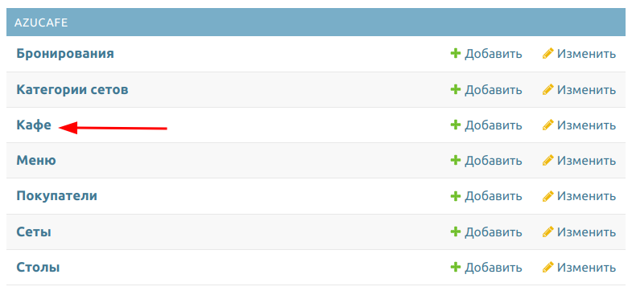

- Нажимаем на кнопку `ДОБАВИТЬ КАФЕ`

  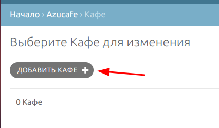

- На открывшейся странице заполняем все поля. ВНИМАНИЕ: Размер файла с картинкой не должен превышать 1Мб

  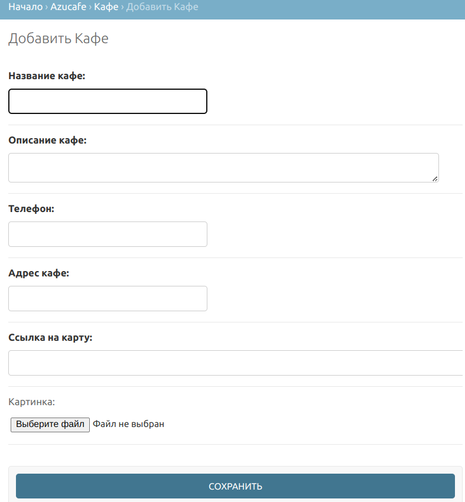

- После заполнения всех полей нажимаем кнопку `СОХРАНИТЬ`

- Повторяем для всех кафе.

#### 4.3 Добавление столов (мест) в кафе

- Возвращаемся на на начальную страницу настроек

  

- Выбираем пункт `Столы` группы `AZUCAFE`

  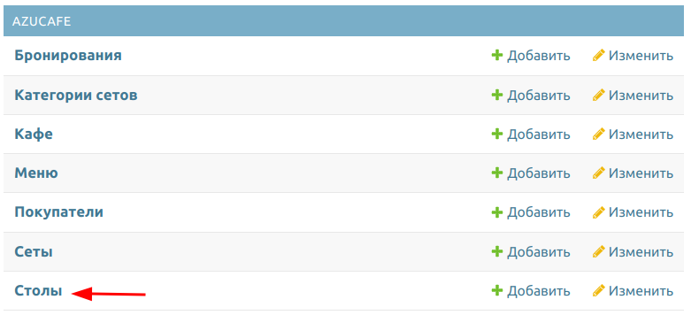

- Нажимаем на кнопку `ДОБАВИТЬ СТОЛ`

  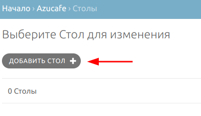

- На открывшейся странице выбираем `Кафе`, задаем номер стола и количество мест за ним.

  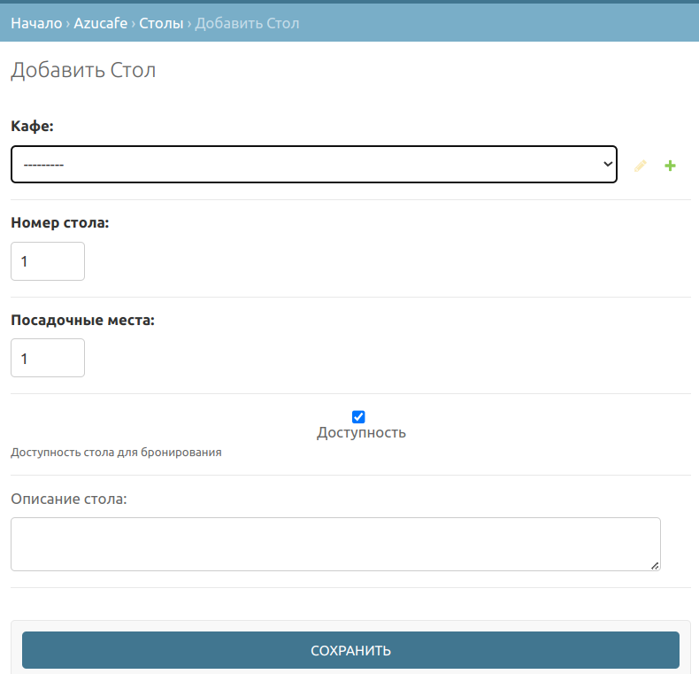

- После заполнения всех полей нажимаем кнопку `СОХРАНИТЬ`

- Повторяем для всех столов и кафе

- ПРИМЕЧАНИЕ: Т.к. распределением гостей по столам осуществляет администратор, то для каждого кафе можно задать только один стол с указанием общего количества мест в кафе.

#### 4.4 Добавление сетов

Сеты распределяются по категориям. 

> Для упрощения процесса создания все сеты можно отнести к одной категории

##### 4.4.1 Добавление категорий сетов

- Возвращаемся на на начальную страницу настроек

  

- Выбираем пункт `Категории сетов` группы `AZUCAFE`

  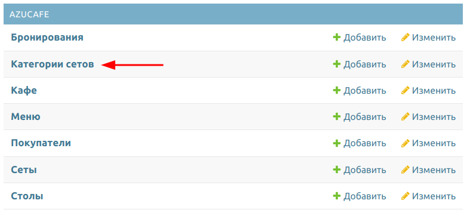

- Нажимаем на кнопку `ДОБАВИТЬ КАТЕГОРИЯ СЕТОВ`

  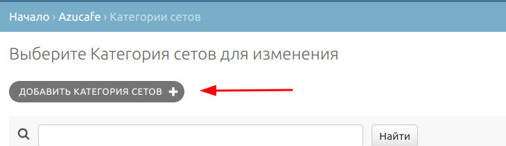

- На открывшейся странице заполняем поля

  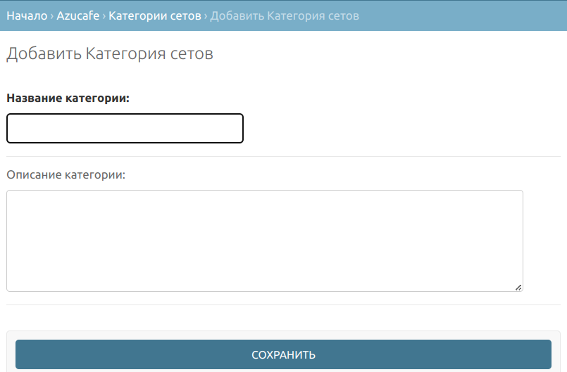

- После заполнения всех полей нажимаем кнопку `СОХРАНИТЬ`

- При необходимости добавляем еще категорий

##### 4.4.2 Добавление сетов

- Возвращаемся на на начальную страницу настроек

  

- Выбираем пункт `Сеты` группы `AZUCAFE`

  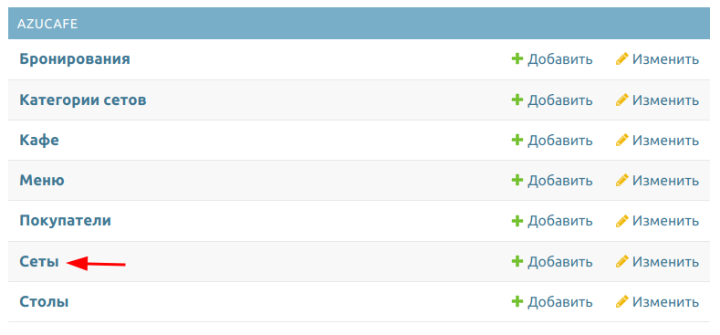

- Нажимаем на кнопку `ДОБАВИТЬ СЕТ`

  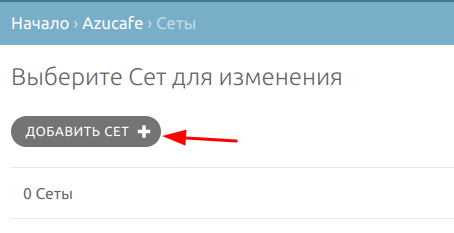

- На открывшейся странице выбираем категорию сета, задаем название сета, его описание, стоимость (в рублях) и выбираем картинку для сета. ВНИМАНИЕ: Размер файла с картинкой не должен превышать 1Мб.

  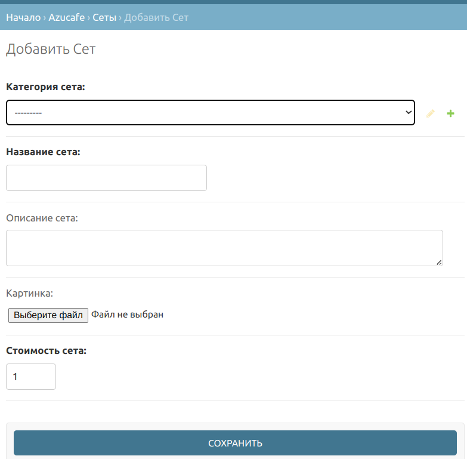

- После заполнения всех полей нажимаем кнопку `СОХРАНИТЬ`

- Повторяем для всех сетов

### 4.5 Первоначальный запуск бота

После первоначальной настройки бота, а так же при обновлении кода бота или перезапуска сервера с ботом, администратор должен подключиться к боту и выполнить команду `/restarttimers` для перезапуска таймеров напоминаний о бронировании.
